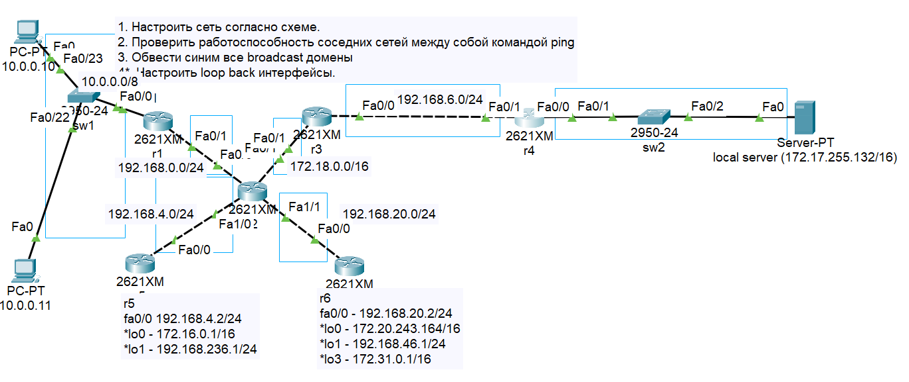
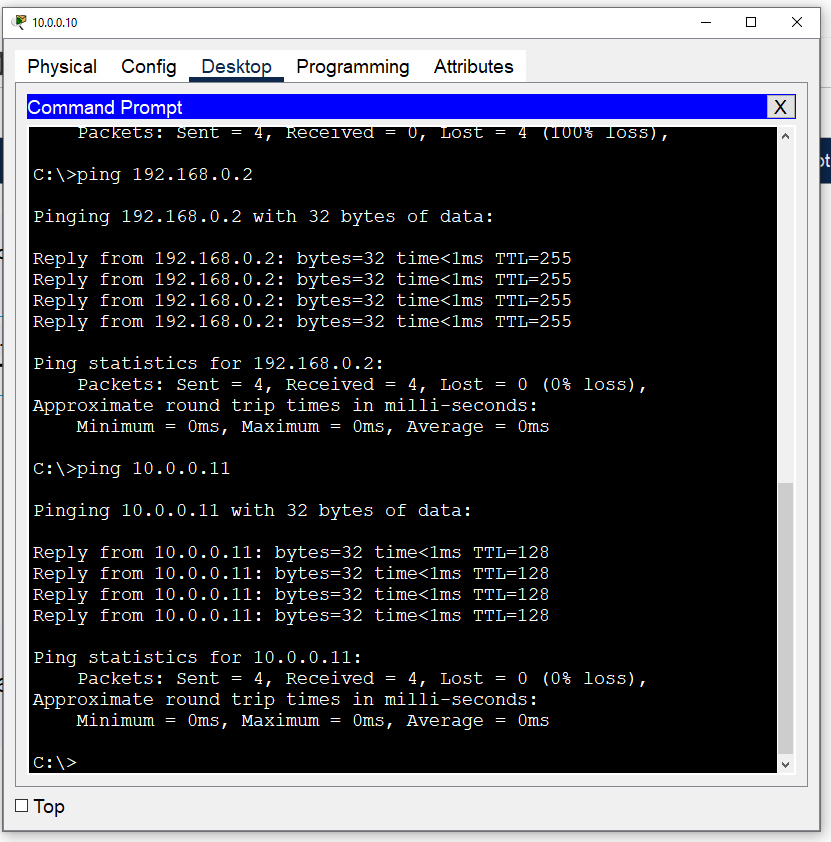
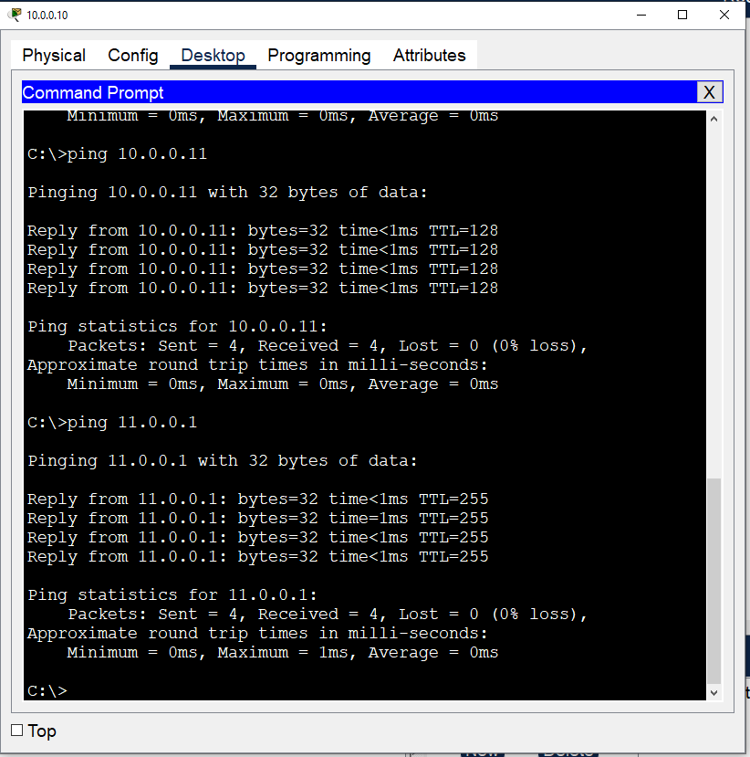
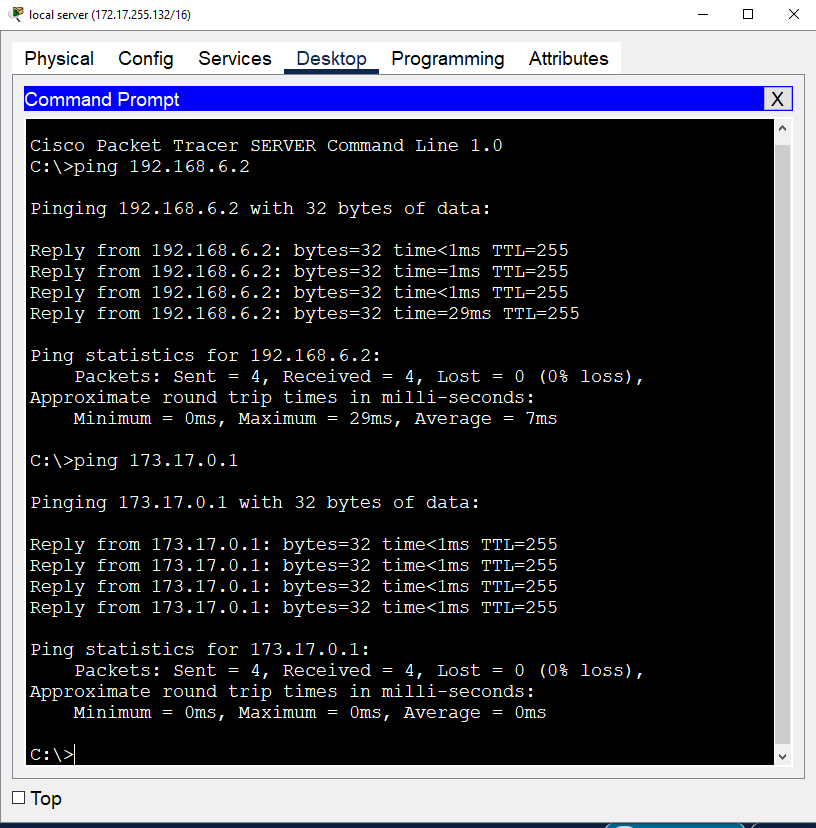
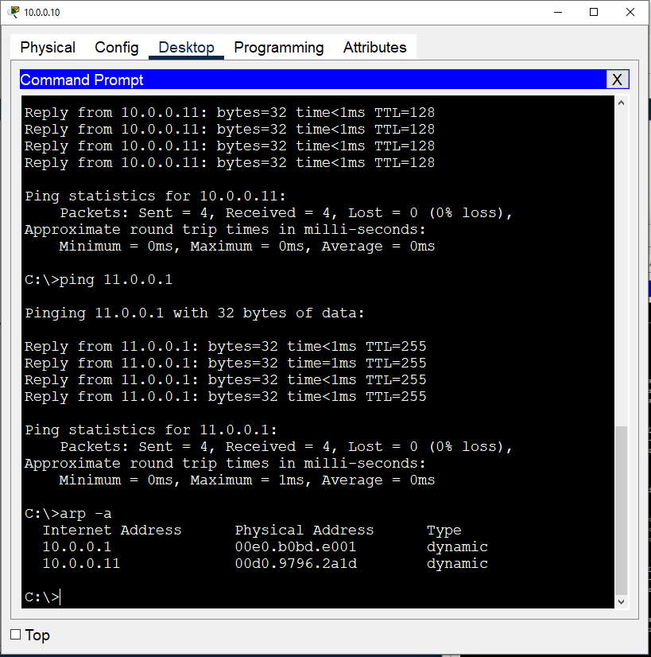

# Учебная домашняя работа задачи:
1) Настроить сеть согласно схеме в файле.
2) Проверить работоспособность соседних между собой сетей командой ping.
3) Обвести синим все broadcast домены.
4) *Настроить loopback интерфейсы.

## Скинуть скриншоты:
— с зелеными линками;

— успешные пинги между парой-тройкой соседних сетей (соседние сети - это Connected сети к одному роутеру);

— вывод любой таблицы ARP
