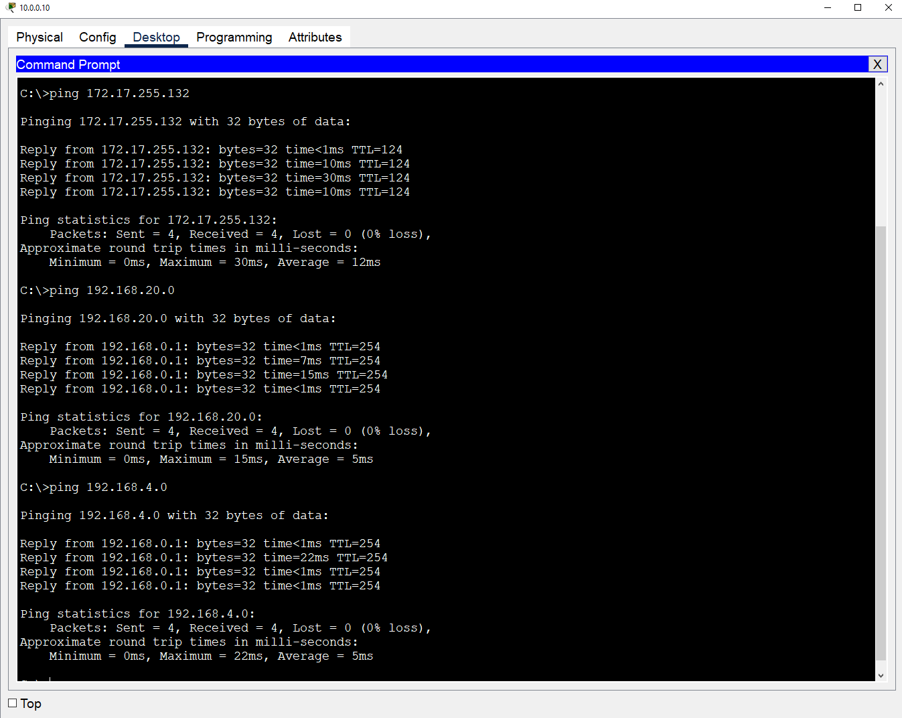
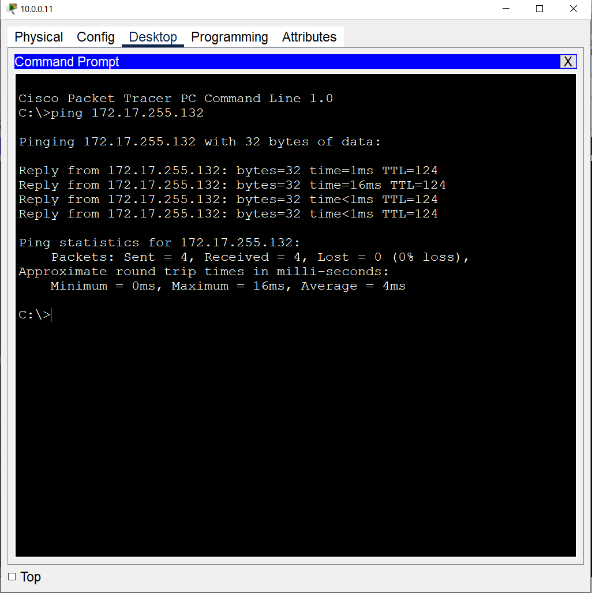
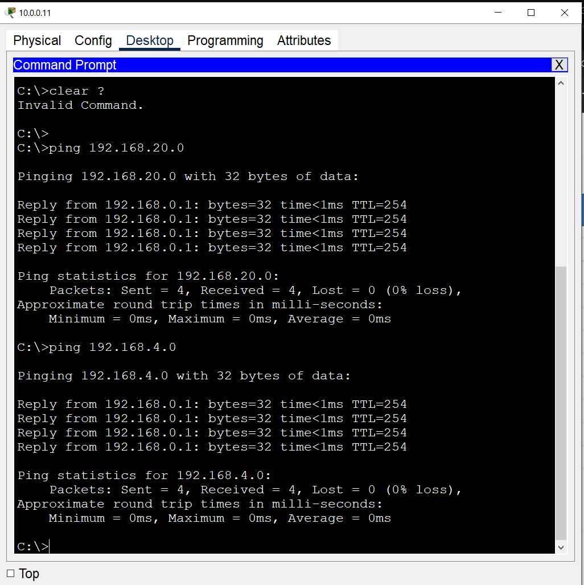
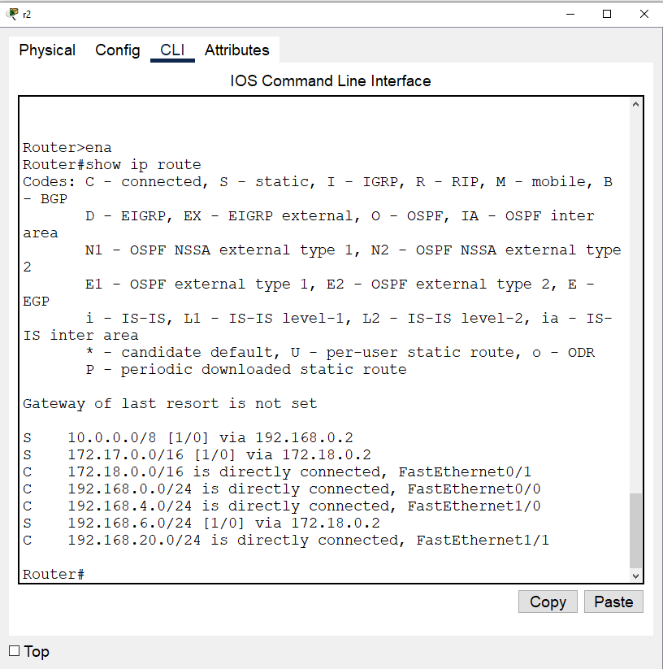
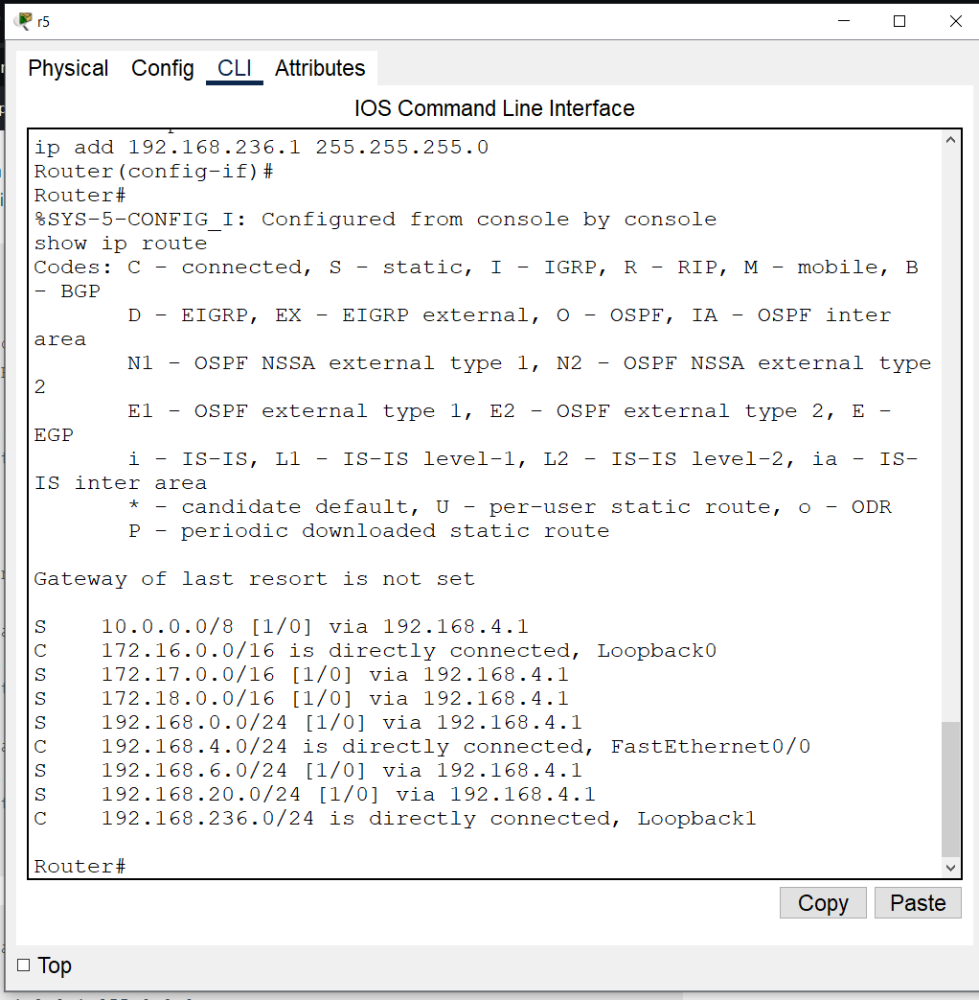
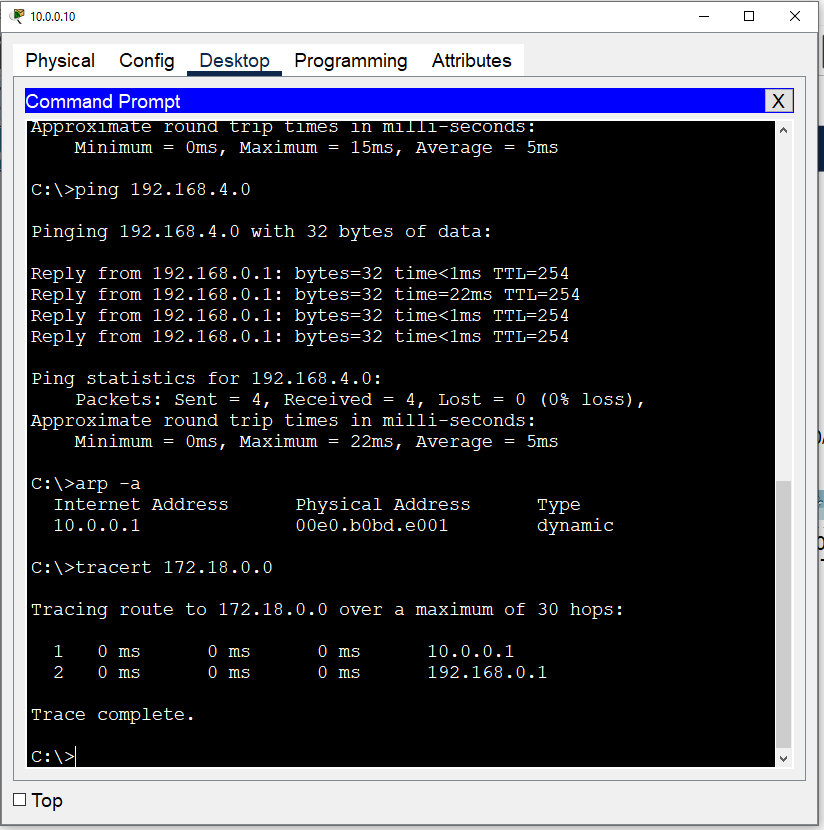
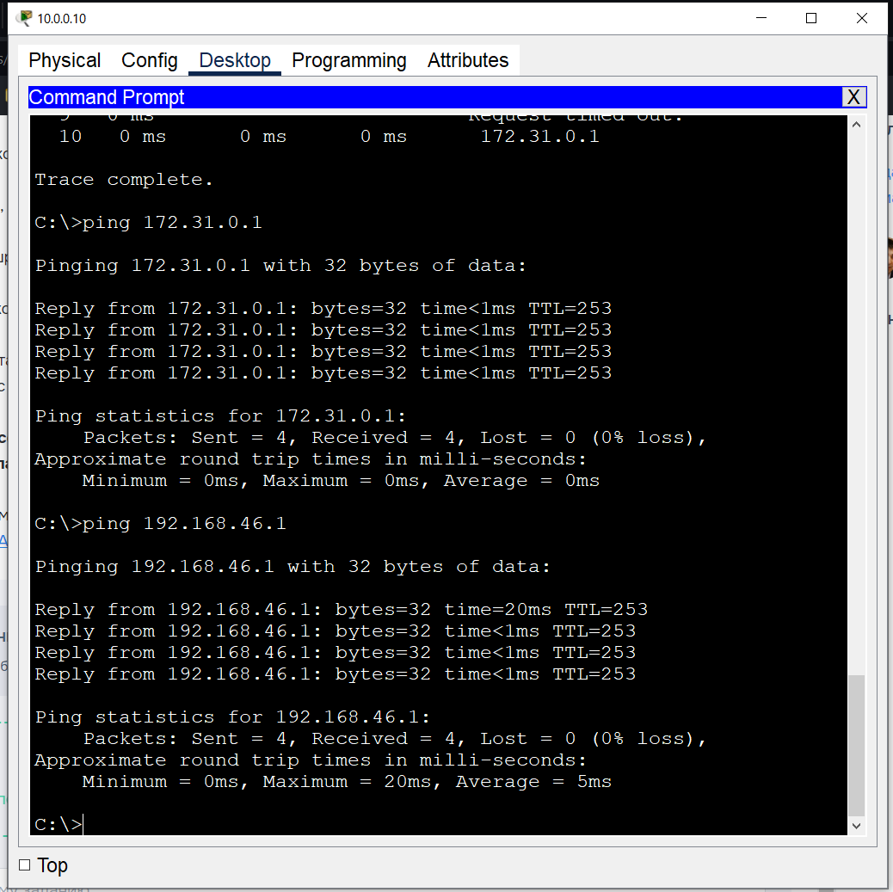
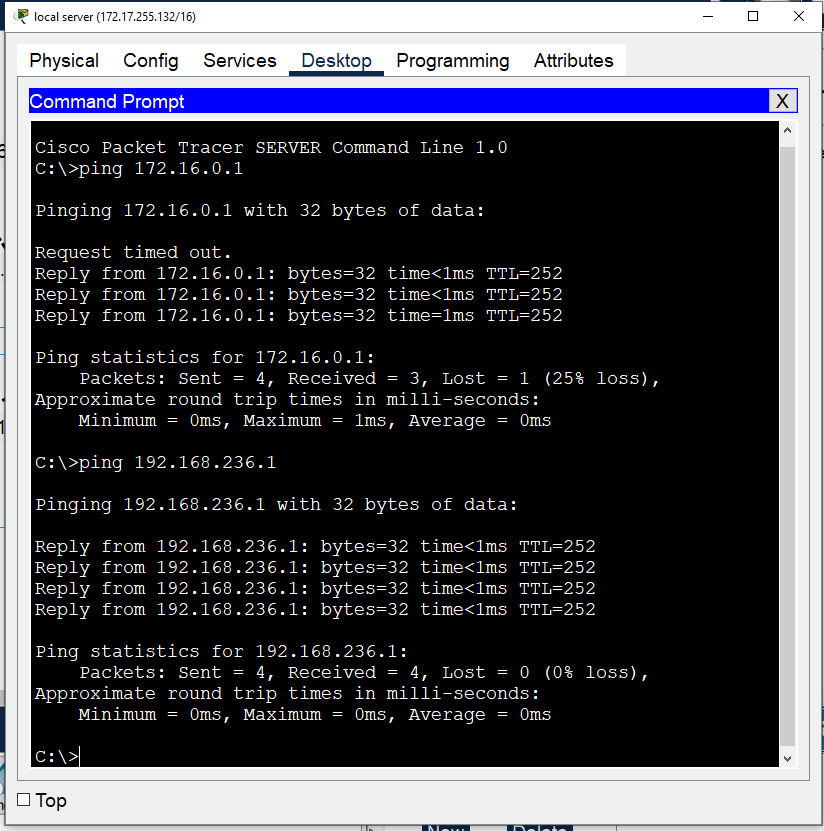

# Домашняя работа по сетям 3 задачи:
1) Усложняем сеть из предыдущего домашнего задания. Используя только статическую маршрутизацию, связать сеть компов и сервера.
2) Проверить работоспособность сети командой ping с компов до сервера и обратно.
- Попробовать настроить статику так, чтобы пинговались все интерфейсы отовсюду.

3) Изучить получившиеся таблицы маршрутизации.

4) Попрактиковаться в использовании команды tracert.

5) Настроить loop back интерфейсы, статику до них и они тоже должны пинговаться

