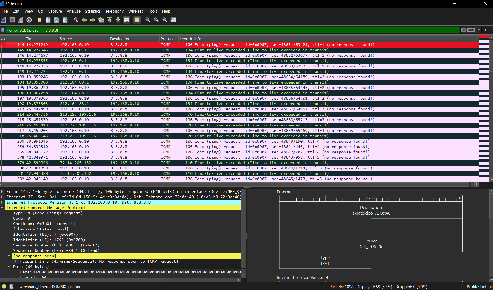

# Учебная домашняя работ по семинару 5. Задачи:
1) В приложенном файле “The Ultimate PCAP.pcap” (из раздаточного материала) найти e-mail. Что внутри письма и для кого оно?

2) Закрепите навыки фильтрования. Запустите трейс до 8.8.8.8. И перехватите его в Wireshark. Проанализируйте.

В Wireshark показывается время задержки (RTT) для каждого узла маршрута. Это позволяет определить, на каком участке маршрута возникают задержки или потеря пакетов.
3) Закрепите навыки фильтрования. Найдите еще один сайт без шифрования с возможностью ввода логина/пароля. (можно в гугл настроить соответствующую выдачу по запросу с ключом “-inurl:https” в конце). Перехватите их в Wiresharke, построив фильтр.

4) На сайте https://launchpad.net/ubuntu/+archivemirrors представлены зеркала с образами Убунту по странам. Скачайте файл ls-lR.gz из Чили и с Яндекса. Снимите два дампа для каждого скачивания. Проанализируйте скорость скачивания и посмотрите tcptrace. Прикиньте средний RTT и поищите максимальный RWND для скачивающего.
Предоставить скриншоты графиков скорости и tcptrace. Есть ли разница? В чем она?
 - Yandex:

 - Chilly:

По графикам видны различия в скорости передачи данных, задержки (RTT) и проблемы с пропускной способностью сети.