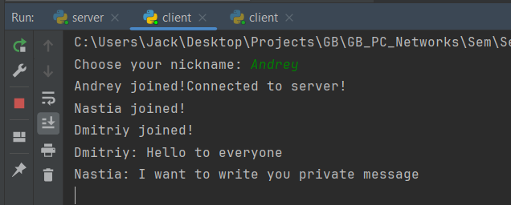
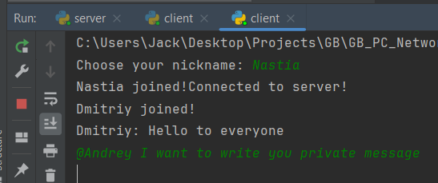
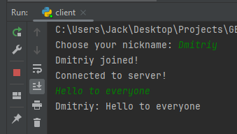
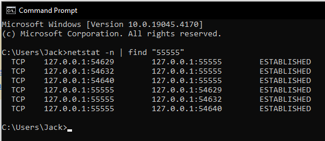
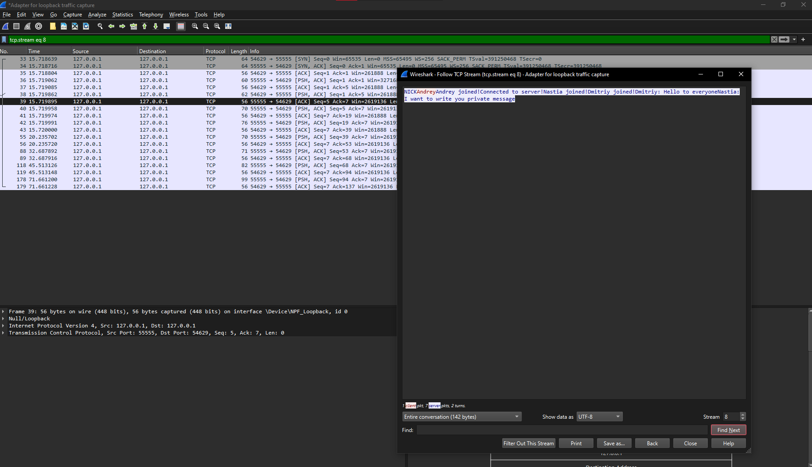

# Учебное домашнее задание на семинар 6: 
1) Напишите свою программу сервер и запустите её (если опыта в python нет, запустите готовый код и разберитесь, как он работает — файл с кодом готового клиента, файл с кодом готового сервера).
Добавленный функционал в коде:
 * Сервер:
 - Добавлена команда для выключения сервера. При получении команды "exit" сервер будет закрывать все соединения и выключаться.
 - Добавлена возможность приватных сообщений между клиентами. Клиент сможет отправлять сообщение конкретному пользователю, указав его никнейм вместо общего сообщения.
 * Клиент:
 - Добавлена команда для выхода из чата. Клиент сможет написать "exit" и выйти из чата, закрыв соединение с сервером.
 - Добавлена возможность приватного сообщения. Клиент сможет указать никнейм пользователя, которому он хочет отправить сообщение, после чего вводит сообщение.

2) Запустите несколько клиентов. Сымитируйте чат.

3) Отследите сокеты с помощью команды netstat (тоже пришлите скриншот именно сокетов вашего чата).

4) Перехватите трафик своего чата в Wireshark и cшейте сессию. Пришлите скриншот сшитой сессии с диалогом.
