# Учебная домашняя работа по семинару 7. Задачи: 
1) Настроить сеть согласно схеме в файле, где:
 — Office 1 — cеть 10.1.1.0/24
 — Office 2 — cеть 10.0.0.0/16
 — Office 3 — cеть 172.16.0.0/16
 — Office 4 — cеть 192.168.145.0/24
 — Где “Интернет” — там имитация Интернета с помощью OSPF, выберите сами публичные сети между роутерами.
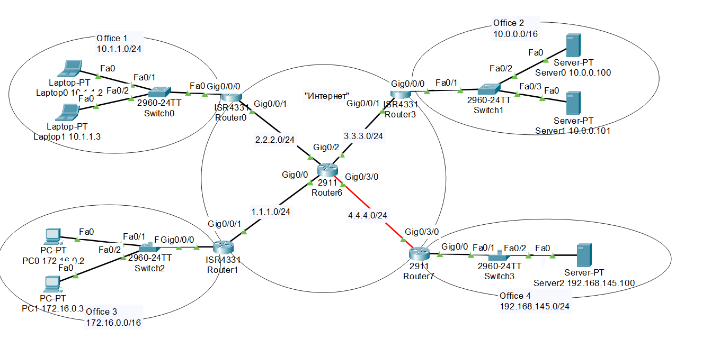

2) Настроить на Port Forwarding на сервера в Office 2. Server0 должен предоставлять HTTP по 80му порту, а Server1 должен предоставлять HTTPS по 443 порту. Странички должны быть разные.
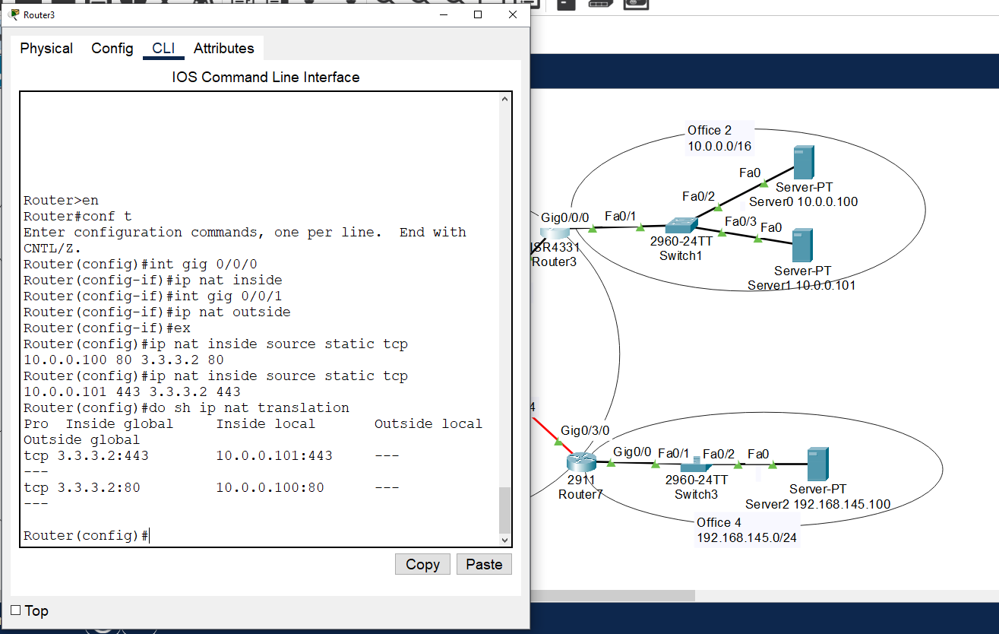

3) Настроить PAT в Office 3 для компьютеров, чтобы они выходили в интернет под одним публичным IP адресом на Router1.

Предоставить скриншот открытых страниц по HTTP и HTTPS по публичному адресу Router3 в веб-браузере клиентов Office3 (с РС1 и РС0);
После чего предоставить вывод show ip nat translation c Router1.
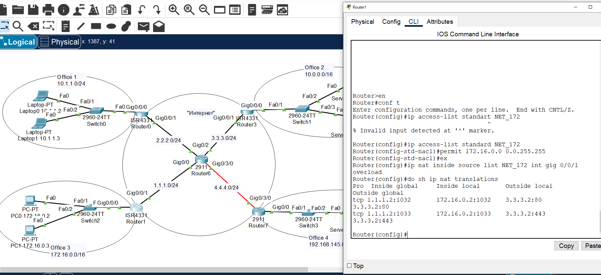
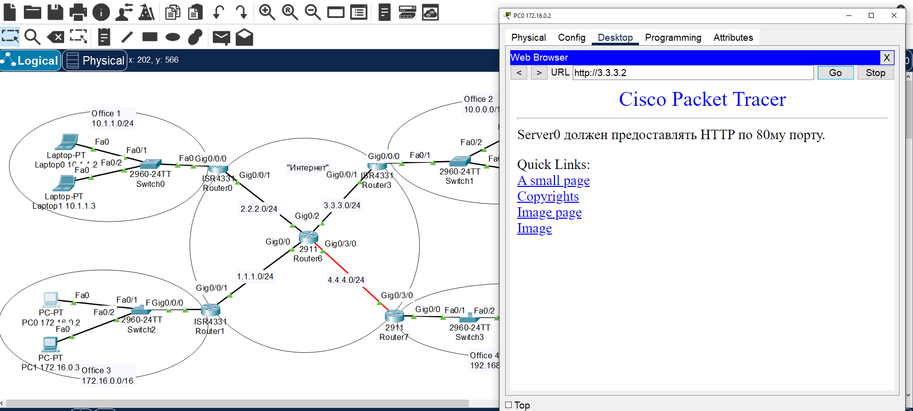
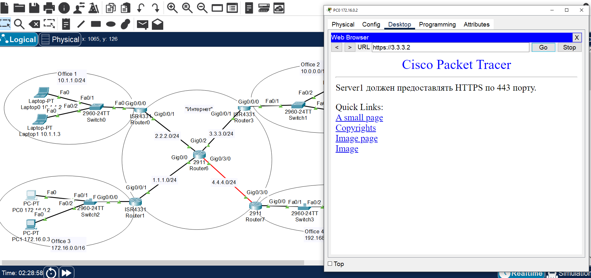

4) Связать сети Office 1 и Office 4 с помощью GRE. Предоставит трейс с Laptop0 до Server2.
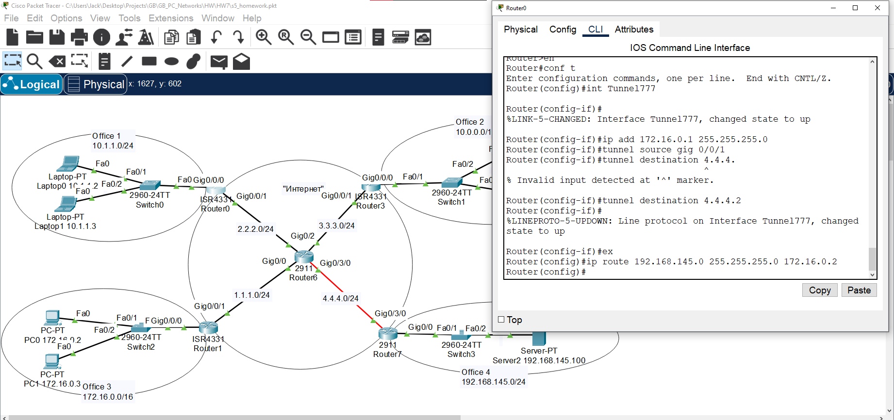
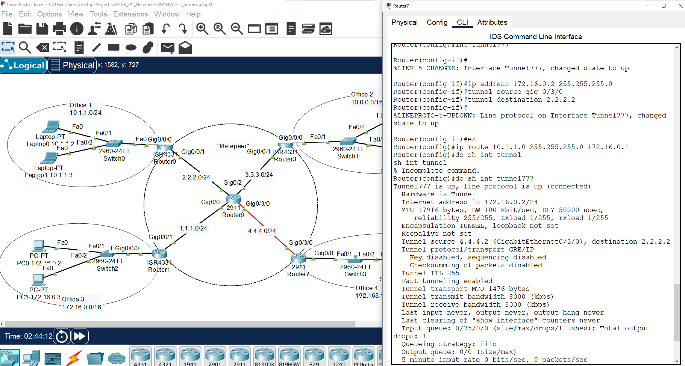
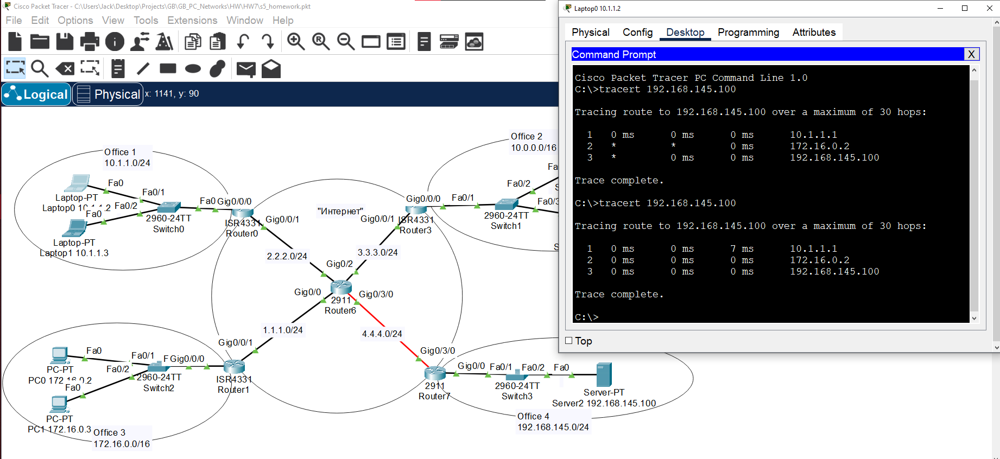

1) Доделать OpenVPN, если не успели. Предоставить скриншот публичного IP до и после подключения через VPN + скриншот вывода команды ip addr.
 - Установка:
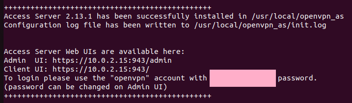
 - Тестирование Веб-клиента и создание пользователя:
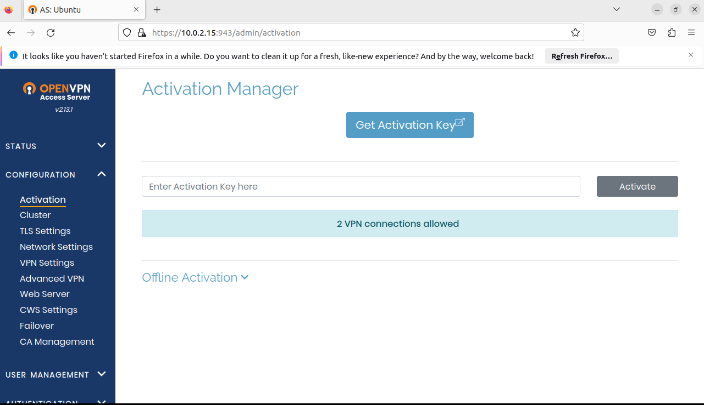
 - Скриншоты публичного ip и после подключения VPN:
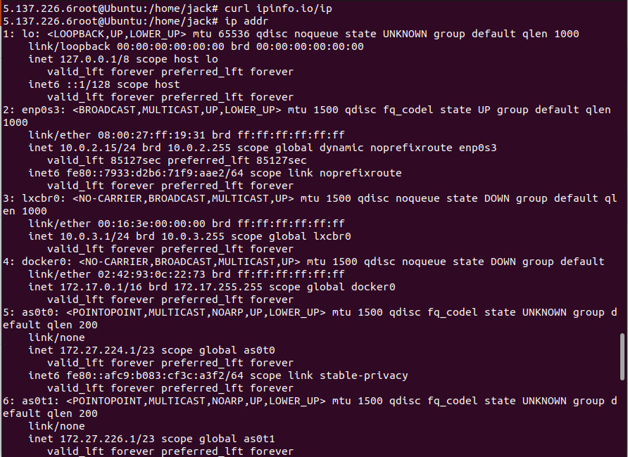