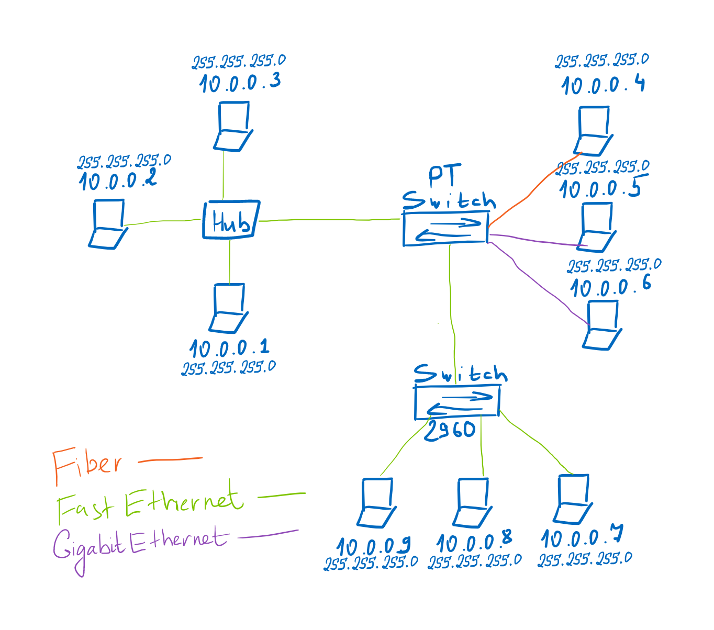

# Учебные задачи на семинар 1:
1) Собрать сеть по схеме:

2) Исправить ошибки в сети из файла s1_task2.pkt;
3) Необходимо ознакомиться, как рассылает пакеты свитч и хаб в режиме симуляции (s1_task2.pkt). Попробовать создать коллизию на хабе и на свитче.