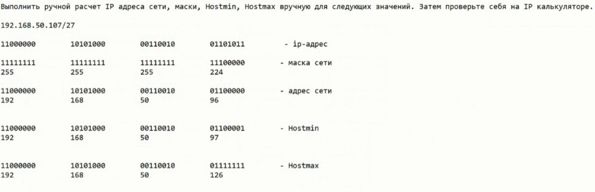
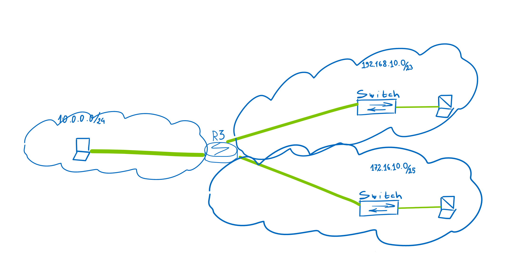

# Учебные задачи на семинар 2
1) Выполнить ручной расчет IP адреса сети, маски, Hostmin, Hostmax вручную для следующих значений. Затем проверьте себя на IP калькуляторе.

2) Необходимо связать сети 192.168.10.0/23, 10.0.0.0/24 и 172.16.10.0/25 между собой, чтобы компы пинговали друг друга. Показать успешный пинг.

 - Поднимите интерфейсы и настройте IP адреса.
 - Пропингуйте соседние устройства.
 - Изучите таблицы ARP и MAC Address table