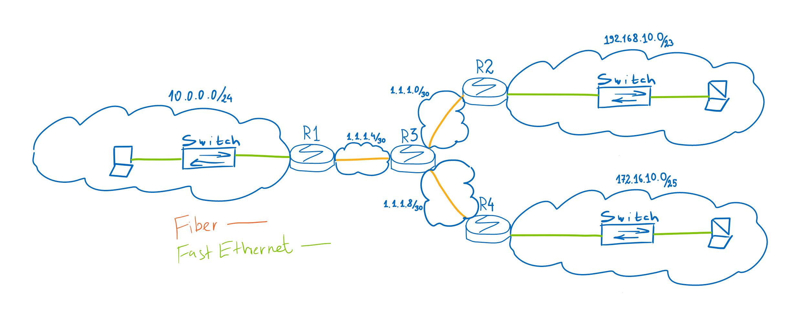

# Учебное задание на семинар 3:
## Необходимо связать только сети 192.168.10.0/23, 10.0.0.0/24 и 172.16.10.0/25 между собой, чтобы компы пинговали друг друга.Показать успешный пинг.  
1) Собрать схему сети.

2) Поднимите интерфейсы и настройте IP адреса. 
3) Пропингуйте соседние устройства. 
4) Пропишите маршруты.