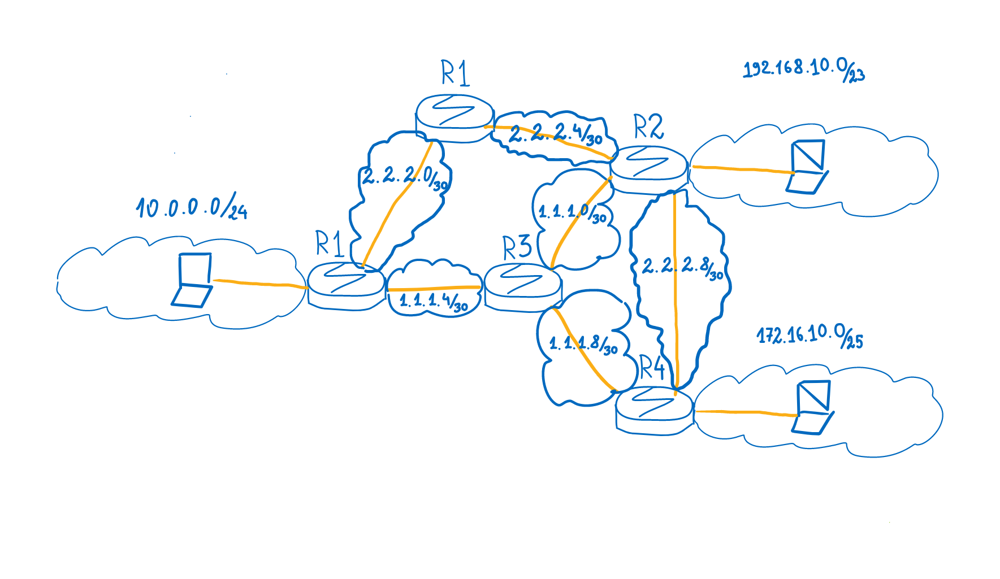
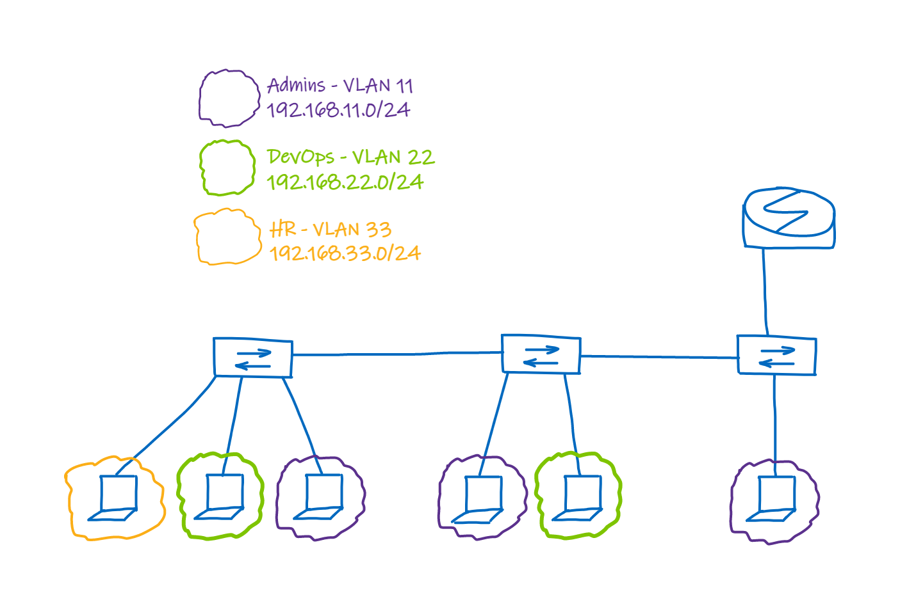

# Ученые задачи на семинар 4:
1) Собрать сеть по схеме на рисунке:

 - Настроить маршрутизацию при помощи OSPF.
 - Убедиться что трафик между компами ходит через два маршрута с помощью ЕСМР.
 - Посмотреть таблицы маршрутизации на роутерах.
2) Собрать сеть по схеме ниже.

 - Настроить VLAN.
 - Компы из этих сетей должны пинговать друг друга через роутер.