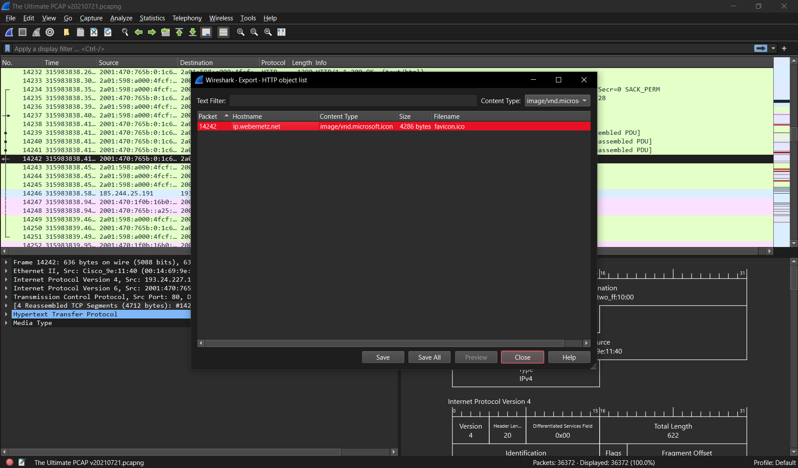

# Учебный семинар 5. WireShark. Задачи:
1) В приложенном файле “The Ultimate PCAP.pcap” найти картинку, какая буква изображена на картинке?
Буква **W**

2) Перехватить логин и пароль с незащищенного сайта:

3) Анализ Upload:

4) Tracert тест:
