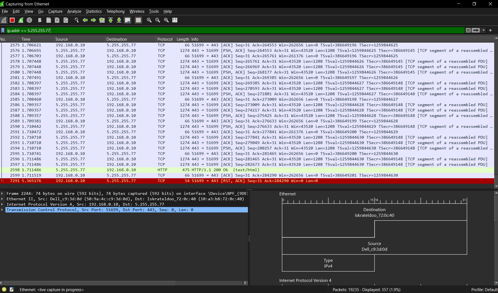
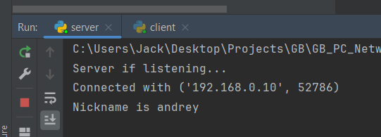
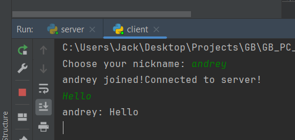

# Учебное задание на семинар 6:
1) Написать на Python код получения страницы yandex и перехватить данные в WireShark

2) Необходимо написать программу-клиент, которая будет цепляться к вашему серверу в Интернете. После того как соединение произошло, первое сообщение будет ником пользователя - 'NICK', а далее, любое отправленное сообщение будет
транслироваться другим клиентам. Таким образом пообщаемся между собой.
 - Сервер запущен на ip-адресе : 158.160.21.38
 - Порт сервера: 55555

