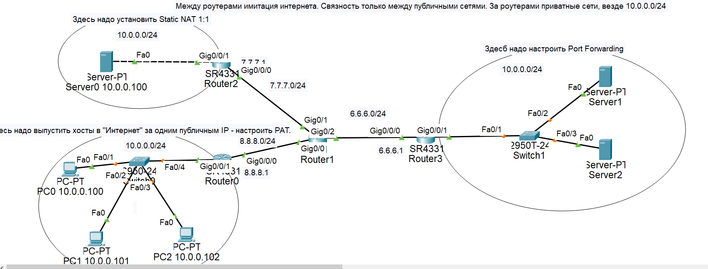
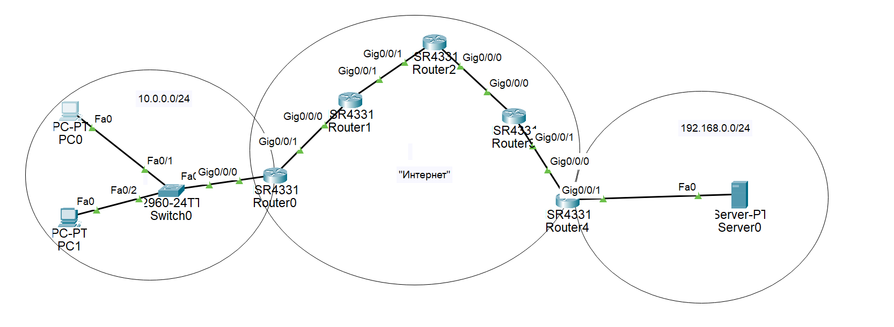
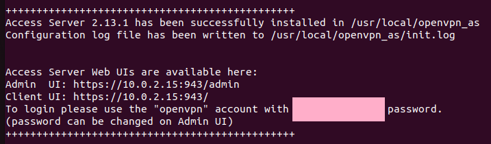
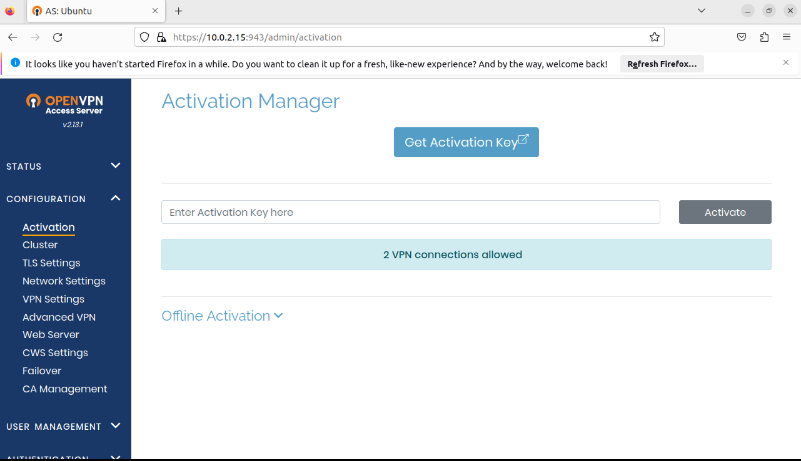
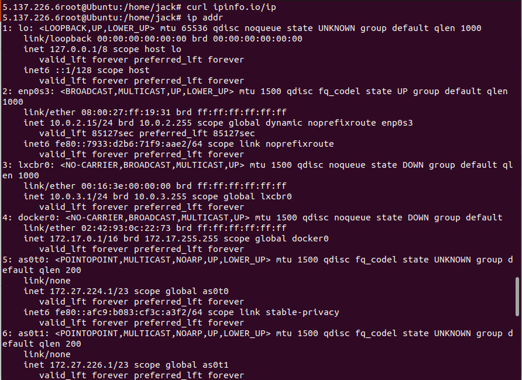

# Учебные задачи на семинар 7
1) Настроить NAT на схеме:

2) Настроить GRE на схеме:

1) Настройка OpenVPN на виртуальной машине.
 - Установка:

 - Тестирование Веб-клиента и создание пользователя:

 - Скриншоты публичного ip и после подключения VPN:
